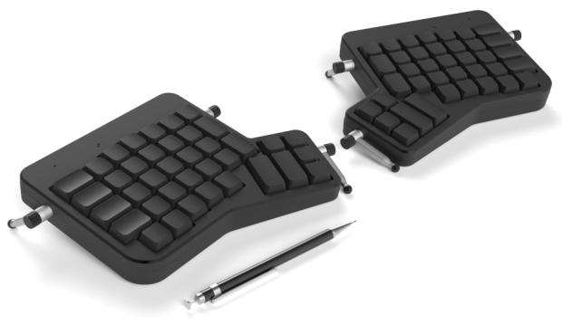
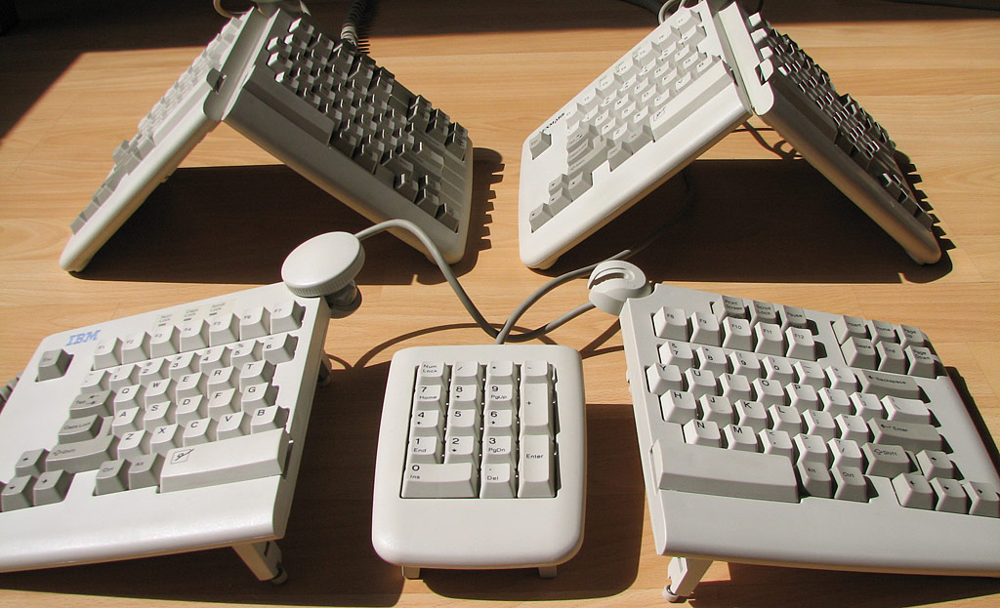
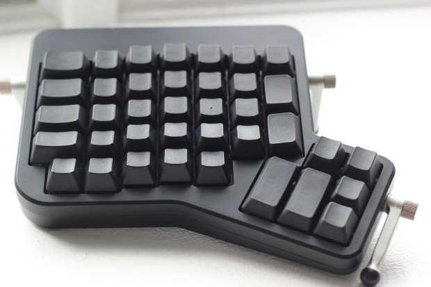
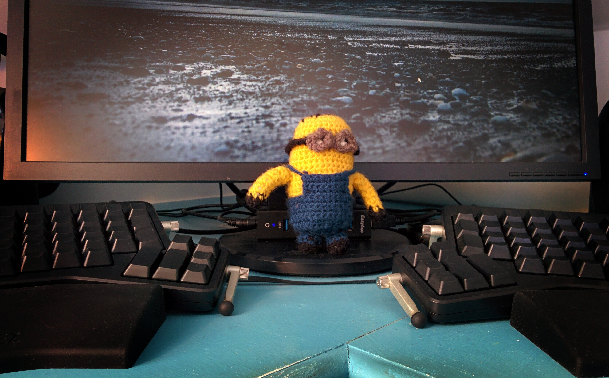

# So, I've gone and bought another keyboard

To the ordinary computer user this will sound like the non-event of the year,
and certainly nothing to be writing about.  However, to coders, the keyboard is
the essential interface to the machine. More powerful than the mouse, more
direct than the touchscreen, it's that which connects us to the machine.
Perhaps as a result, some coders get ever so slightly obsessive over their
choice of keyboard.

All of which is a long winded way of introducing the minor fact that I have
assaulted my credit card by spending a three-figure sum on a keyboard. Again.

To those that know me, this will come as little surprise. However, to those
for whom this is a shocking thing to do, you may of course continue reading if
you wish, but I fear nothing I can write will justify such a purchase when a
dozen bucks will buy you something perfectly serviceable for the practice of
coding.

But mere "serviceability" is not the goal here. Oh no, gentle reader, this is a
search for nothing short of perfection! A possibly Sisyphean task, probably
futile, certainly costly, but one to which a curious number of coders find
themselves drawn. As with all such cliques, a certain lingo is employed and you
can easily identify keyboard connoisseurs by noting those geeks in the room
whose attention is easily distracted at the mention of phrases like "Cherry
Blue", "Buckling Spring", or "M15" (though I would urge qualifying this last
with "IBM" to avoid accidentally drawing the attention of military weapons
enthusiasts).

## The Ergodox Project

Recently, a new term has entered the lexicon of keyboard aficionados:
"Ergodox".  From what I can gather, the [Ergodox][ergodox] keyboard began as an
amateur project, by which I mean no slight to the skill of the individuals
involved; I use the word in the historical sense―this was a project by
"lovers of" keyboards. Perhaps in the modern vernacular, one might call it a
maker's project.

The obvious advantage of such a project is customization: tweak the design, the
components, the look, everything about it to your exact specifications! The
disadvantage is the cost in both time and materials (mass production is
*always* cheaper). Whilst the concept appealed to me, my days of hand
assembling hardware to exacting specifications are long over. I'm still
endlessly picky about components, but I'm happy to pay some other entity to
assemble the damned thing. It's purely software that I construct these days.

Then, out of the blue, the [Ergodox EZ][ergodoxez] project appeared on
Indiegogo! The opportunity to own such a device with none of the hassle of
assembling it! And thanks to the aforementioned economics of mass production,
for little more than one would expect to pay for the bare components! Right,
that's enough exclamation marks for one paragraph, here's what it looks like:

It's a keyboard drawing on influences from a variety of past designs but with
some fascinating twists. The most obvious influence is that of the so called
"ergonomic" keyboards, specifically the "split" design popularized by the
[Microsoft Natural keyboard][mnk], but echoed in [numerous][split1]
[other][split2] [devices][split3]. The Ergodox is likewise split, but rather
than being a solid unit which merely separates the keys, or even one with a
pivot joining the two halves, it follows the lead of the venerable, and much
sought after, [IBM M15][m15] which had two entirely separate halves. The
obvious advantage is that no matter where you like to rest your palms, the keys
for each hand can be placed there―something even pivoted designs cannot fully
claim (the M15 had a pivot, but it contained no wiring and could entirely
split).

## Split Keyboards Suck (for me)

At this point I should go on the record as *hating* split keyboards. All such
keyboards that I've tried in the past (including Microsoft's effort) have
lasted no more than a day before being unceremoniously discarded. The reason is
largely a consequence of my typing skills being self-taught. Before I'd learned
cursive writing at school, I was already proficient at typing on the (strangely
rectilinear) keyboard of my father's [Sharp MZ-80K][mz]. While I later adjusted
to the more common [staggered layout][staggered] on an [Acorn
Electron][electron], I never learned to adhere to the strict discipline of the
[home row][homerow]. My fingers may *start* there, but they wander like a piano
player's (a discipline I was also learning at the time).

Some combinations I find easy to type with a single hand if I just shift it a
little; "[byobu][byobu]" is something I often type at the start of the day. A
traditional touch typist will enter this with left index finger (b), right
index finger (y), right fourth finger (o), left index finger (b), and right
index finger (u). Personally though, I shift my right hand left one column and
dance a little jig with the index (b), middle (y/u), and fourth (o) fingers,
whilst my left hand attends to a mug of coffee.  Now look at any conventional
split design keyboard, and note where the aforementioned keys lie. Oh dear.

Until recently, if I wanted a split keyboard I'd have to unlearn my typing
practices of the last 30+ years.

Now, look again at the M15 and notice the space bar. It's not really a bar;
it's two wide keys. Well, that much is common to almost all split designs, but
the M15 duplicated something else too (as far as I know, uniquely): it
duplicated the cursor keys. A decent innovation to be sure, but it always made
me wonder―what if a split keyboard duplicated some of the letter keys in the
middle of the keyboard so that either the left *or* right hands could type
them?

Here's a closer look at the left half of the Ergodox EZ keyboard; you can see
where the left index finger is meant to sit (the raised bump on the unlabelled
"f" key). Count the columns to the right (while admiring the non-staggered
nature of said columns):

## Flexible Firmware (oxymoron?)

Having satisfied ourselves that there are enough keys to accommodate my
particular keyboarding style (yes, apparently one can make a gerund from
"keyboard", or so says Google), the next question is whether the design
actually incorporates said duplicate keys. The key-caps give little clue, being
completely black. Is this a gimmick? A fashion statement? A [cunning
ploy][daskeyboard] to improve users' typing skills? None of the above.

This brings us to the next piece of genius in the Ergodox: a micro-controller
with a fully open-source firmware.  For the uninitiated this means: you get to
program the keyboard. Fully. Right down to what you want the LEDs to do and
when.

Want a single key that hits `Ctrl+Alt+Del`? Easy. Want to press a combination
and have a whole Perl "hello world!" script spew into your editor? No problem.
But any decent macro system or key-remapper could manage this stuff. How about
a key that when touched types back-tick, but when held becomes a Ctrl key? How
about a key that when pressed changes the entire layout of the keyboard to
something else like a numeric keypad and some custom symbols common to
programming? Now we're getting beyond most systems, but not the Ergodox. The
point of the blank key-caps is quite simply that the keys are *whatever you
want*.

I checked out the default firmware on the Ergodox EZ before mine arrived to see
how easy it'd be to customize. If you're vaguely au fait with C, it's a doddle.
The default firmware provides a simple set of globals defining the key layouts
and a whole bunch of macros for defining keys. You don't need to understand
things like scan codes (or even globals or macros for that matter). You can
easily re-map any key on the keyboard, and define keys which switch role
between characters and modifiers (like the aforementioned back-tick-cum-Ctrl)
without any serious C knowledge.

After the keyboard arrived I spent a day experimenting with alternate
firmwares. Within a single day I tried out three significantly different
layouts before deciding on a base and starting my own customization. I quickly
came up with a design incorporating the duplicated letter keys I craved, and
then started on more subtle customizations. A week of experimentation later, I
had something that fit me like a glove.

It was at this point I noticed that the LEDs on the keyboard were really rather
bright. A bit too bright. I wondered if I could dim them a bit. 5 minutes later
I had the LEDs running at a quarter of their brightness. At which point I
wondered if I could get the LEDs to smoothly fade in and out rather than just
blinking on and off. 10 minutes later my LEDs smoothly faded in and out in
response to certain keys (no, not Caps Lock―that should be a Ctrl key
anyway―they indicate what layout the keyboard is currently using).

This is a potential issue: if you know a bit of C and are obsessive about your
keyboards, this particular device is going to cost you several days of
productive time in tinkering. I like to think I'll make them back in gained
productivity down the road. Stop laughing.

## Finger Feel ([phrasing][phrasing])

We've established we can layout the keys any way we want. But what do the keys
actually feel like? It turns out the firmware isn't the only customizable
aspect of the Ergodox EZ; you can also select the key switches you want (from
the Gateron range as the classic [Cherry MX][cherrymx] switches proved too
difficult to source; Gaterons, while frequently referred to as "Cherry
knockoffs", are acknowledged as decent imitations of the real deal).

Want a soft, quiet keystroke? The popular brown switches are for you. Gaming?
Take the red pill. Having fallen in love with a loud, clicky keyboard many
years ago, I naturally went for the blues (I also work from home which removes
the additional need to build sound-proof walls between myself and my
co-workers).

Once the keyboard arrived, I compared the action of the Gateron blues to the
Cherry MX blues in my old keyboard (admittedly numerous years old now). I doubt
I could tell the difference blind-folded, so Gateron are a damned near perfect
imitation (assuming they last many years of heavy usage, which I have little
reason to doubt).

In use, the keyboard feels quite strange at first. The non-staggered layout
takes a couple of days to get used to, but works very nicely once you're used
to it. The greatest novelty is the lack of "separate areas". There's no
dedicated numeric keypad (something I thought might be a deal-breaker).
Instead, I've programmed the firmware so that holding a thumb button changes
the right hand keys into a numeric key-pad.

What about the cursor keys? I've done something similar with the left hand
keys; hold a thumb button and the classic "WASD" gaming keys become the
inverted-T of the cursor keys (but if you prefer you could make this another
layer for the right hand).

Overall, despite the fact my hands wander from the home row on occasion, I'm
certain my hands move significantly less on this keyboard than on anything else
I've used.

## Miscellany

The Ergodox EZ comes with some novel options that the classic Ergodox lacks:
adjustable (thumb-screwed) legs and wrist rests (dubbed "wings").

The legs are extremely welcome; I'm not sure how the keyboard could be angled
properly without them. The wing I'm less convinced by―rubber and keyboards
brings back bad memories of finger burns on a ZX Spectrum―but they do align the
hands nicely with the base of the keyboard. Perhaps if the top was made of
something … not rubber?

## Perfection?

It should be obvious by this point that I'm a fan of the Ergodox EZ. How close
to perfect is it? For typing, damned near. I struggle to think of any typing
task it hasn't improved upon.

Still, if there's one thing I'd definitely change, it'd be the number of inner
letter keys. The inner-most columns (where I've duplicated keys in my firmware)
have two "tall" rows of keys rather than the three normal height rows in the
other columns. This meant I couldn't fully duplicate the keys of the opposing
sides. In the end I went with Y and H on the left (for single handed typing of
"yes", "have", "he", etc.), with G and B on the right (for "byobu", "by",
"buy", "go", etc.)

The large thumb buttons are perfect, but the top row of small thumb buttons
requires some gymnastics for me to reach (hence I almost never use them).
Perhaps a more fan-like layout of large buttons would be preferable?

Still, these are minor quibbles. It's with non-typing related tasks that the
keyboard is notably lacking compared to other devices in my collection. A minor
point is the lack of a USB hub. Given my machine is a tower tucked under the
desk, USB ports on the desk above it are most welcome and this was a need my
old Das Keyboard fulfilled nicely. That said, my next keyboard (prior to the
Ergodox EZ) also lacked a hub. This was easily fixed with the addition of a
small hub sat under the monitor, with the bonus that it was USB3.

A more serious lack―but one I freely acknowledge would be nigh on impossible
for the Ergodox EZ makers to rectify given the licensing involved―is the lack
of a [nipple][nipple]. During my years at IBM I came to appreciate the
fundamental superiority of the nipple to *every* other form of mouse control
(and no, I never heard anyone call it a "TrackPoint™"). Your hands need not
leave the comfort of the keyboard (or even the home row), touch-pads cannot
rival to it for fidelity of control (try dragging and dropping with a nipple
compared to a touch-pad; you'll never look back), and despite sitting in the
literal middle of the keyboard it never seems to get in the way of typing
(unlike touch-pads which endlessly register my damned palm).

After my Das, I was fortunate enough to own an [Endura Pro][unicomp]. This has
the beautiful buckling-spring action of a Model M, combined with the sheer
brilliance of the Thinkpad's nipple (though sadly it lacked the middle
scrolling button, an extremely annoying deficit in its design). This was as
close to typing nirvana as I'd come, but the Ergodox has certainly redefined
that, at least for the task of typing. I'll even go so far as to say I prefer
the blue switches to the buckling-spring (fully realizing that may raise cries
of "heresy" from some). The blues just feel a touch "lighter" while retaining
that crisp, tactile feedback so essential to accuracy. But dammit, I miss the
nipple ([hey, phrasing][phrasing]!)

In summary, I can't label the Ergodox "perfection" because it's not: no
keyboard will earn that title while it lacks that little red nub, and even
without it there's still a couple of minor changes I'd make. However, its novel
layout, the customizability, the feel of the switches, all adds up to the most
enjoyable typing experience I've ever had. It's my current keyboard of choice
which, given the company it's in, is high praise indeed.

And, let's face it, pure black keyboards just look *cool* …

Dave.

(2016-02-29)

[ergodox]: http://ergodox.org/
[ergodoxez]: https://www.indiegogo.com/projects/ergodox-ez-an-incredible-mechanical-keyboard#/
[mnk]: https://en.wikipedia.org/wiki/Microsoft_Natural_keyboard
[split1]: https://geekhack.org/index.php?topic=52429.0
[split2]: http://shop.goldtouch.com/collections/ergonomic-keyboards/products/goldtouch-v2-adjustable-comfort-keyboard-pc-only-includes-usb-and-ps2-connector
[split3]: http://www.datamancer.net/keyboards/ergo1/ergo1.htm
[m15]: http://www.geek.com/chips/ibm-m15-split-ergonomic-keyboard-hits-ebay-bidding-war-1287797/
[mz]: https://en.wikipedia.org/wiki/Sharp_MZ
[staggered]: http://loup-vaillant.fr/articles/better-keyboards
[electron]: https://en.wikipedia.org/wiki/Acorn_Electron
[homerow]: https://en.wikipedia.org/wiki/Touch_typing
[byobu]: http://byobu.co/
[daskeyboard]: http://www.daskeyboard.com/blog/type-like-a-badass-go-blank/
[phrasing]: https://youtu.be/hyLWrKh2fB0?t=11s
[cherrymx]: http://www.keyboardco.com/blog/index.php/2012/12/an-introduction-to-cherry-mx-mechanical-switches/
[nipple]: https://xkcd.com/243/
[unicomp]: http://www.pckeyboard.com/page/category/EnduraPro
